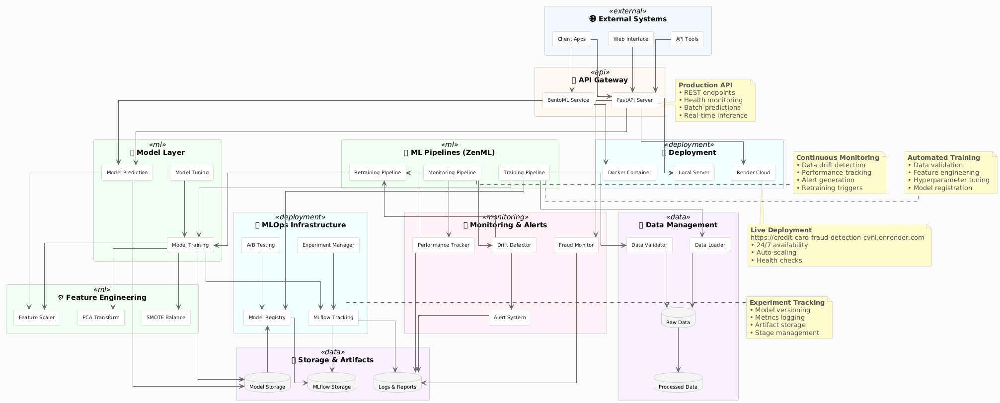

# Credit Card Fraud Detection

This project implements a machine learning pipeline for detecting credit card fraud using software engineering best practices and MLOps principles.

## 🚀 Live Demo

**API Endpoint:** https://credit-card-fraud-detection-cvnl.onrender.com

### Try It Out

**Interactive API Documentation:**
- 📊 Swagger UI: https://credit-card-fraud-detection-cvnl.onrender.com/docs
- 📖 ReDoc: https://credit-card-fraud-detection-cvnl.onrender.com/redoc

## Project Structure

```
credit_card_fraud_detection/
├── data/
│   ├── raw/          # Raw, immutable data
│   ├── processed/    # Cleaned and processed data
│   └── external/     # External data sources
├── src/              # Source code
│   ├── data/         # Data ingestion and preprocessing
│   ├── features/     # Feature engineering
│   ├── models/       # Model training and evaluation
│   └── visualization/# Data visualization and reporting
├── notebooks/        # Jupyter notebooks for exploration
├── models/           # Trained models and artifacts
├── reports/figures/  # Generated plots and reports
├── tests/            # Unit and integration tests
├── docs/             # Documentation
├── scripts/          # Utility scripts
├── config/           # Configuration files
├── docker/           # Dockerfiles and container configs
├── ci/               # CI/CD scripts
├── deployment/       # Deployment configurations
├── monitoring/       # Monitoring and logging
├── .github/workflows/# GitHub Actions workflows
├── pyproject.toml    # Project metadata and dependencies
├── requirements.txt  # Python dependencies
├── .gitignore        # Git ignore rules
└── README.md         # This file
```
## 🏗️ System Architecture

The following diagram illustrates the end-to-end MLOps architecture for the credit card fraud detection system including data ingestion, feature engineering, model training, experiment tracking, and API deployment.

<p align="center">
  
</p>

## Usage

- Data preprocessing: Run scripts in `src/data/`
- Feature engineering: Use modules in `src/features/`
- Model training: Execute scripts in `src/models/`
- Deployment: Use configurations in `deployment/`

## License
